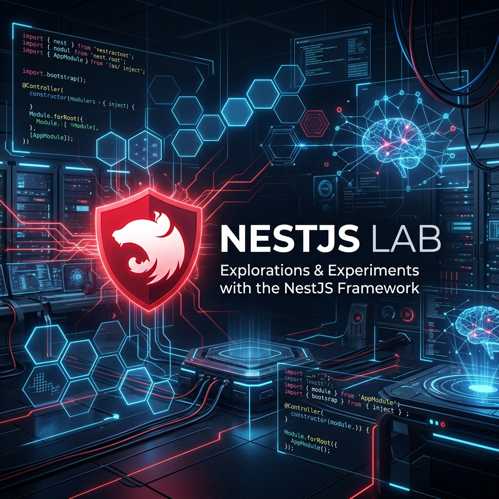

# 🚀 NestJS Lab: Advanced Microservices Architecture & Best Practices



[](https://nestjs.com/)
[](https://nodejs.org/)
[](https://www.typescriptlang.org/)
[](https://microservices.io/)

[](https://github.com/deepakabari/nestjs-lab/stargazers)
[](https://github.com/deepakabari/nestjs-lab/network/members)
[](https://github.com/deepakabari/nestjs-lab/issues)

## 🌟 Overview

**NestJS Lab** is a high-performance, production-ready laboratory for exploring and implementing modern **microservices architecture** using **Node.js** and **NestJS**. This repository serves as a comprehensive blueprint for developers looking to build scalable, maintainable, and secure distributed systems.

Whether you are a seasoned architect or a developer diving into microservices for the first time, this "Lab" provides the tools, patterns, and examples needed to master cross-service communication, centralized authentication, and modular design.

---

## 🎯 Why NestJS Lab?

In today's digital landscape, building monolithic applications often leads to bottlenecks. **NestJS Lab** solves this by demonstrating how to:
- **Scale Independently**: Each microservice (Auth, User, Product) can be scaled based on its specific load.
- **Maintain High Performance**: Utilizes **TCP Transporters** for lightning-fast internal communication.
- **Ensure Robust Security**: Implements centralized **JWT Authentication** and **Role-Based Access Control (RBAC)** across the entire ecosystem.
- **Follow Clean Code Patterns**: Uses a **Shared Library** approach to maintain consistency and reduce code duplication.

---

## 🛠 Key Features

- **🛡️ API Gateway**: A unified entry point that routes traffic and handles global transformations.
- **🔑 Centralized Auth**: Secure authentication and authorization powered by JWT.
- **👤 Identity Management**: Comprehensive user CRUD operations with role management.
- **📦 Product Catalog**: Scalable product management service.
- **📡 TCP Communication**: Optimized inter-service communication using NestJS Microservices.
- **🏷️ Snake Case Integration**: Seamless transformation between camelCase and snake_case for standardized APIs.
- **📝 Automated Documentation**: Fully integrated Swagger/OpenAPI for all service endpoints.

---

## 🧪 Project Modules

This laboratory is an ever-growing collection of NestJS implementations. Explore the available modules below:

| Module | Status | Description |
| :--- | :--- | :--- |
| [🚀 Microservices Demo](nestjs-microservice-demo) | ✅ Ready | TCP-based microservices with API Gateway & Auth. |
| **🛡️ Auth0 Integration** | 🏗️ Coming Soon | Centralized auth using Auth0 identity provider. |
| **☁️ AWS Cognito** | 🏗️ Coming Soon | AWS Cognito integration for user pools & federation. |
| **⚡ NestJS CRUD** | 🏗️ Coming Soon | Rapid development of CRUD APIs with TypeORM. |

---

## 📂 Project Structure

```bash
nestjs-lab/
├── docs/                     # Documentation and assets
├── nestjs-microservice-demo/ # Core microservices implementation
├── nestjs-auth0/             # (Future) Auth0 Lab
├── nestjs-cognito/           # (Future) Cognito Lab
└── README.md                 # Lab Entry Point
```

---

## 🚀 Getting Started

To get the lab up and running on your local machine, follow these steps:

1. **Clone the Repository**:
   ```bash
   git clone https://github.com/deepakabari/nestjs-lab.git
   cd nestjs-lab
   ```

2. **Explore the Demo**:
   Navigate to the core project and follow the detailed [installation guide](nestjs-microservice-demo/README.md).
   ```bash
   cd nestjs-microservice-demo
   npm install
   npm run start:all
   ```

---

## 🤝 Contributing

Contributions are what make the open-source community such an amazing place to learn, inspire, and create. Any contributions you make are **greatly appreciated**.

1. Fork the Project
2. Create your Feature Branch (`git checkout -b feature/AmazingFeature`)
3. Commit your Changes (`git commit -m 'Add some AmazingFeature'`)
4. Push to the Branch (`git push origin feature/AmazingFeature`)
5. Open a Pull Request

---

## 📜 License

Distributed under the MIT License. See `LICENSE` for more information.

---
